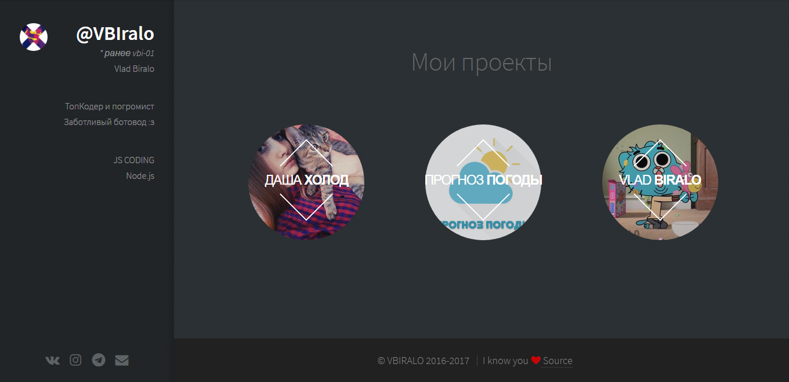

# vbiralo.github.io

This is a simple and minimalistic site designed for developers who want to show their portfolio or something else: D

## Questions

Having any issues file a [GitHub Issue](https://github.com/VBIralo/vbiralo.github.io/issues/new).

## License

This theme is free and open source software, distributed under the The MIT License. So feel free to use this site anyway you want.

## Credits

This site was partially developed with inspiration from this person
- [Vlad Biralo](https://github.com/VBIralo)
